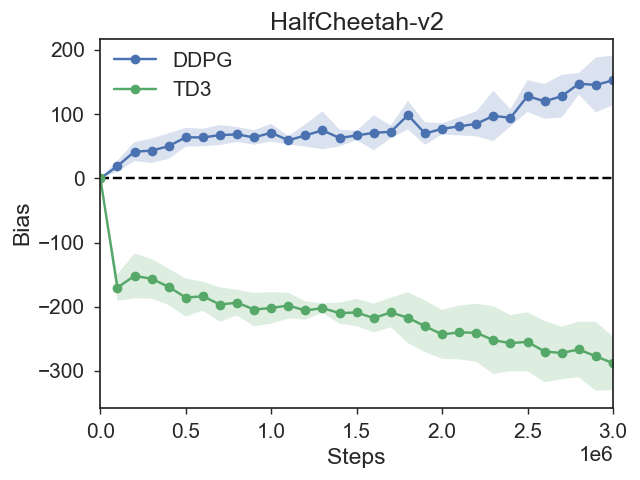

### Example Code for computing value estimation bias in MuJoCo
- Supported Algorithms
    - [Deep Deterministic Policy Gradients (DDPG)](https://arxiv.org/abs/1509.02971)
    - [Twin Delayed Deep Deterministic Policy Gradients (TD3)](https://arxiv.org/abs/1802.09477)

### How to compute value estimation ?
- Solution: The value estimates are averaged over 1000 states sampled from the replay buffer every 1e5 iterations, and the true values are estimated using the average discounted long-term rewards following the current policy, starting from the sampled states (recommended in [Twin Delayed Deep Deterministic Policy Gradients (TD3)](https://arxiv.org/abs/1802.09477) and [Softmax Deep Double Deterministic Policy Gradients (SD3)](https://arxiv.org/abs/2010.09177)).


## Instructions
### Recommend: Run with Docker
```bash
# python        3.6    (apt)
# pytorch       1.4.0  (pip)
# tensorflow    1.14.0 (pip)
# Atari, DMC Control Suite, and MuJoCo
# Attention: Need `mjkey.txt`!!
cd dockerfiles
docker build . -t estimationRL
```
For other dockerfiles, you can go to [RL Dockefiles](https://github.com/LQNew/Dockerfiles).

### Launch experiments
Run with the scripts `batch_run_value_estimation_4seed_cuda.sh`:
```bash
# eg.
bash batch_run_value_estimation_4seed_cuda.sh Humanoid-v2 DDPG_value_estimation 0  # env_name: Humanoid-v2, algorithm: DDPG, CUDA_Num : 0
```

### Plot results
**Recommend: Install Seaborn==0.8.1 for ploting value estimation bias**
- ```bash
  pip install seaborn==0.8.1
    ```
- Example1: plot the value estimation bias of DDPG and TD3:
    ```bash
    python spinupUtils/plot_bias.py \
        data/DDPG_value_estimation-HalfCheetah-v2-estimation/ \
        data/TD3_value_estimation-HalfCheetah-v2-estimation \
        --env HalfCheetah-v2 \
        -l  DDPG TD3 -s 0
    ```
    
<br>
- Example2: plot the reward of DDPG and TD3:
    ```bash
    python spinupUtils/plot_reward.py \
        data/DDPG_value_estimation-HalfCheetah-v2-reward/ \
        data/TD3_value_estimation-HalfCheetah-v2-reward \
        --env HalfCheetah-v2 \
        -l  DDPG TD3 -s 0
    ```

### Citation
```bash
@misc{QingLi2021ValueEstimationRL,
  author = {Qing Li},
  title = {ValueEstimationRL,
  year = {2021},
  publisher = {GitHub},
  journal = {GitHub repository},
  howpublished = {\url{https://github.com/LQNew/ValueEstimationRL}}
}
```